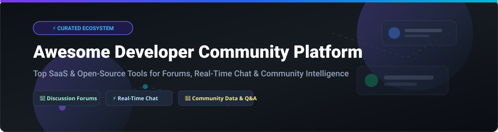

# Awesome Developer Community Platform 🚀

  
  
  
  

## 🌐 Top Developer Community Platforms Ecosystem

**A Curated List of SaaS Products & Open-Source GitHub Projects for Community Management, Discussion Forums, Real-Time Chat, Community Intelligence & Member Engagement.**

> Developer community platforms help organizations, open-source projects, and DevRel teams build, manage, scale, and engage developer ecosystems—ranging from long-form async discussion forums and Q&A knowledge bases to real-time chat servers and AI-powered community analytics.

---

## 📑 Table of Contents
- [📊 Market Overview & Size](#-market-overview--size)
- [☁️ SaaS & Hosted Community Platforms](#%EF%B8%8F-saas--hosted-community-platforms)
- [🔓 Open-Source Community GitHub Projects](#-open-source-community-github-projects)
  - [💬 Forum & Discussion Platforms](#-forum--discussion-platforms)
  - [⚡ Team Chat & Real-Time Communication](#-team-chat--real-time-communication)
  - [🧠 Q&A & Knowledge Platforms](#-qa--knowledge-platforms)
  - [🛠️ Lightweight & Specialized Platforms](#%EF%B8%8F-lightweight--specialized-platforms)
- [🤝 How to Contribute](#-how-to-contribute)
- [💖 Support & Sponsorship](#-support--sponsorship)
- [📈 Star History](#-star-history)
- [⚠️ Disclaimer](#%EF%B8%8F-disclaimer)

---

## 📊 Market Overview & Size

The global **Developer Community & Customer Community Software Market** is estimated at **$2.4 Billion USD** (2026), expanding at a CAGR of **14.2%**. The market exhibits **moderate fragmentation**:
- **Real-Time Communication & Chat**: Dominated by high-density platforms (*Discord*, *Slack*) in a winner-take-most dynamic.
- **Forums & Async Knowledge**: Led by established stalwarts (*Discourse*) alongside specialized enterprise community software (*Higher Logic Vanilla*, *Bettermode*).
- **Community Intelligence & DevRel Data**: A rapidly evolving, fragmented segment (*Common Room*, *Orbit*) driven by AI aggregation across multi-channel developer touchpoints.

---

## ☁️ SaaS & Hosted Community Platforms

Below is a curated comparison of leading SaaS developer community platforms, ordered by company size (valuation / estimated market capitalization / funding scale, descending).

| Platform 🛠️ | Description 📝 | Starting Price 💵 | Free Tier / Trial Limit 🎁 | Company Size (Valuation / Funding) 🏢 |
| :--- | :--- | :--- | :--- | :--- |
| **[Discord Community Suite](https://discord.com/)** | Dominant real-time voice, video, and text chat platform for developer communities with massive bot ecosystem. | $0 / month (Nitro at $9.99/mo per user) | Free forever (Unlimited text/voice channels, 25MB upload limit, 50 custom emojis) | $15.0 Billion (Valuation) |
| **[Common Room](https://www.commonroom.io/)** | Enterprise community intelligence platform aggregating activity across GitHub, Discord, Slack, and X with AI workflows. | $499 / month | 14-day free trial (Up to 2,500 contacts, 3 data sources) | $600 Million (Valuation / $56M raised) |
| **[Higher Logic Vanilla](https://www.higherlogic.com/)** | Enterprise-grade community & discussion forum software with knowledge base and moderation suite. | $650 / month | 14-day free trial (Full platform sandbox access) | $350 Million (Valuation) |
| **[Bettermode](https://bettermode.com/)** | All-in-one no-code community builder with discussions, events, member profiles, and AI search. | $19 / month (Lite plan) | Free forever (Up to 100 members, basic spaces & search) | $50 Million (Valuation) |
| **[Orbit](https://orbit.love/)** | Developer relations & community growth platform tracking member engagement and activity scores. | $200 / month | Free forever (Up to 200 members, 3 integrations) | $45 Million (Valuation / $15M raised) |
| **[Discourse Cloud](https://www.discourse.org/)** | Managed hosting for Discourse open-source forum platform with plugins, SSO, and CDN. | $20 / month (Basic plan) | 14-day free trial (No credit card required) | $30 Million (Estimated market value) |
| **[Zulip Cloud](https://zulip.com/)** | Cloud-managed topic-based team chat platform optimized for asynchronous developer discussions. | $6.67 / user / month | Free forever (10,000 search history, 5GB storage, free Standard upgrade for open-source) | $15 Million (Funding / Enterprise scale) |
| **[Guild.xyz](https://guild.xyz/)** | Token-curated & credential-based community access management platform for Web3/Dev communities. | $0 / month (Custom integrations available) | Free forever (Unlimited public guilds and role rules) | $10 Million (Valuation / $8M raised) |
| **[Geneva](https://www.geneva.com/)** | All-in-one community chat app organizing groups into rooms, audio lounges, and event calendars. | $0 / month | Free forever (Unlimited chat rooms, audio channels, and event scheduling) | $8 Million (Funding) |
| **[Answer Overflow](https://www.answeroverflow.com/)** | Search engine indexer for Discord discussions, transforming chat conversations into web Q&A content. | $15 / month (Pro server plan) | Free forever (Index up to 500 questions/month to web search) | $2 Million (Seed valuation) |

---

## 🔓 Open-Source Community GitHub Projects

Explore production-grade open-source community software. Each repository includes a link to its real-time star count and stargazers page, sorted by star count in descending order.

### 💬 Forum & Discussion Platforms

- **[Discourse](https://github.com/discourse/discourse)**   
  *GPL-2.0+* | **The de facto standard open-source discussion forum platform.** Built with Ruby on Rails and PostgreSQL. Features real-time chat, topic threading, fine-grained moderation, badges, and an extensive plugin ecosystem powering communities serving millions of monthly visitors.

- **[Forem](https://github.com/forem/forem)**   
  *AGPL-3.0+* | **Open-source software for building modern, publishing-first developer communities (powering DEV.to).** Features rich markdown publishing, member profiles, tag-based feeds, articles, and comment discussions.

- **[NodeBB](https://github.com/NodeBB/NodeBB)**   
  *GPL-3.0* | **Fast Node.js real-time forum software with modern web sockets UI.** Supports MongoDB, Redis, or PostgreSQL backends with plugins, notifications, and mobile-responsive layout.

- **[Flarum](https://github.com/flarum/flarum)**   
  *MIT* | **Delightfully simple, fast, and lean forum software.** Built with PHP and Mithril.js. Features a modern single-page interface, fast performance, extensible extension system, and lightweight footprint.

- **[HumHub](https://github.com/humhub/humhub)**   
  *AGPL-3.0* | **Flexible open-source social network and community kit.** Features customizable spaces, member activity streams, file sharing, user profiles, and modular marketplace.

- **[Vanilla Forums (OSS)](https://github.com/vanilla/vanilla)**   
  *GPL-2.0* | **Flexible multi-theme open-source discussion forum.** Traditional PHP community engine offering customizable discussion boards, categories, and moderation controls.

---

### ⚡ Team Chat & Real-Time Communication

- **[Mattermost](https://github.com/mattermost/mattermost)**   
  *AGPL-3.0 / Commercial* | **Open-source enterprise Slack alternative.** High-security self-hosted developer collaboration suite featuring real-time channels, audio calls, playbook automation, integrations, and compliance capabilities.

- **[Rocket.Chat](https://github.com/RocketChat/Rocket.Chat)**   
  *MIT / Enterprise* | **Self-hosted communication platform for teams and communities.** Features channels, direct messaging, voice/video conferencing, matrix bridge, and sandboxed app engine.

- **[Zulip](https://github.com/zulip/zulip)**   
  *Apache-2.0* | **Real-time team chat with a unique, powerful topic-based threading model.** Combines the immediacy of Slack with the async organization of email, making remote team communication efficient.

- **[Matrix Synapse](https://github.com/element-hq/synapse)**   
  *AGPL-3.0* | **Open-source reference reference server implementation of the decentralized Matrix chat protocol.** Enables end-to-end encrypted federated messaging across communities.

---

### 🧠 Q&A & Knowledge Platforms

- **[Apache Answer](https://github.com/apache/answer)**   
  *Apache-2.0* | **Modern open-source Q&A community platform software.** Build Stack Overflow-style technical knowledge bases, developer Q&A communities, and product support forums with voting, reputation, and tags.

- **[Talkyard](https://github.com/debiki/talkyard)**   
  *AGPL-3.0* | **Hybrid community discussion platform combining forum, chat, Q&A, and blog comments.** Privacy-focused Disqus and Reddit alternative designed for thoughtful community discourse.

- **[Storyden](https://github.com/Southclaws/storyden)**   
  *MPL-2.0* | **Self-hosted community and knowledge platform written in Go & TypeScript.** Features structured forum threads, collaborative wikis, resource directories, and optional AI summarization.

---

### 🛠️ Lightweight & Specialized Platforms

- **[TSBOARD](https://github.com/sirini/tsboard)**   
  *MIT* | **Lightweight Vue 3 + Go SPA community frontend for constrained servers.** Reddit-style feed, galleries, marketplace, and Tiptap editor with OAuth.

- **[Nodyx](https://github.com/Pokled/Nodyx)**   
  *AGPL-3.0* | **Self-hosted multi-format community platform.** Combines indexed forum, real-time chat, P2P voice channels, collaborative canvas, and homepage builder.

- **[PieFed](https://github.com/pieFed/pieFed)**   
  *AGPL-3.0* | **Open-source federated social discussion platform.** Uses ActivityPub protocol for decentralized Fediverse community interaction.

- **[Aura Admin](https://github.com/gdg-x/aura-admin)**   
  *MIT* | **Web platform for tech community management.** Designed for Google Developer Groups (GDGs) and tech chapters to manage events and attendees.

- **[Talawa](https://github.com/PalisadoesFoundation/talawa)**   
  *GPL-3.0* | **Open-source mobile and web application to manage community organizations.** Maintained by the Palisadoes Foundation for non-profit and developer groups.

---

## 🤝 How to Contribute

Contributions are always welcome! 🛠️

1. **Fork** the repository.
2. **Create** a new feature branch (`git checkout -b feature/add-new-platform`).
3. **Add** your entry to `README.md` following the tabular or categorized format.
4. **Verify** pricing, free tier limits, star counts, and licensing.
5. **Submit** a Pull Request with a short summary of the additions.

---

## 💖 Support & Sponsorship

If you found this curated ecosystem list helpful for your DevRel team, open-source project, or community architecture, please consider supporting the maintenance of this repo:

- ⭐ **Star** this repository to increase its visibility.
- 🔀 **Fork** and share it with fellow developer relations professionals and community managers.
- ☕ **Buy me a coffee**: Sponsor ongoing maintenance on the [GitHub Sponsor Dashboard](https://github.com/sponsors/ishandutta2007).

Thank you for building great developer communities! ❤️

---

## 📈 Star History

---

## ⚠️ Disclaimer

- This is a community-curated directory — not an exhaustive list or official endorsement.
- Developer community platforms process user data, conversations, and analytics; ensure your chosen stack adheres to GDPR, CCPA, and enterprise compliance standards.
- Commercial SaaS solutions provide turnkey no-code builders and managed analytics, while open-source projects give full data sovereignty and customization at the cost of infrastructure overhead.
